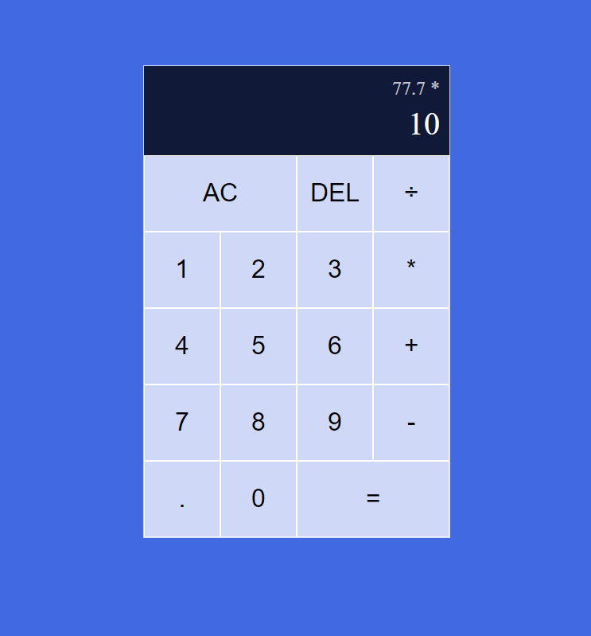

# React Calculator

React Calculator is a simple calculator application built with React.



## Features

- Basic arithmetic operations (addition, subtraction, multiplication, division)
- Clean and intuitive UI

### You can use the calculator at: https://react-calculator-seven-woad.vercel.app/

## Getting Started

### Prerequisites

- [Node.js](https://nodejs.org/) (v14.0.0 or higher)
- [npm](https://www.npmjs.com/) (v6.0.0 or higher)

### Installation

1. Clone the repository:
```bash
  git clone https://github.com/deyordanov/React-Calculator.git
```

2. Navigate to the project directory:
```bash
  cd React-Calculator
```

3. Install the required dependencies:
```bash
  npm install
```

4. Start the development server:
```bash
  npm run dev
```
5. Usage:
  Open your web browser and visit http://localhost:3000 to use the calculator.

## Support

  If you encounter any bugs or have suggestions, please open an issue on the [GitHub repository](https://github.com/deyordanov/React-Calculator/issues).

